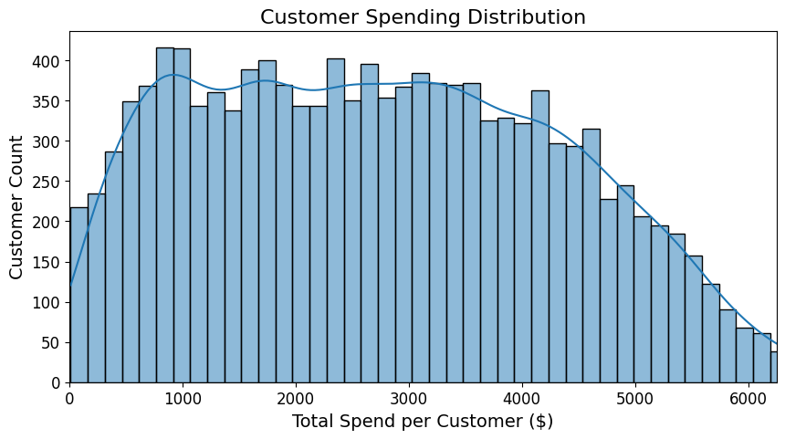
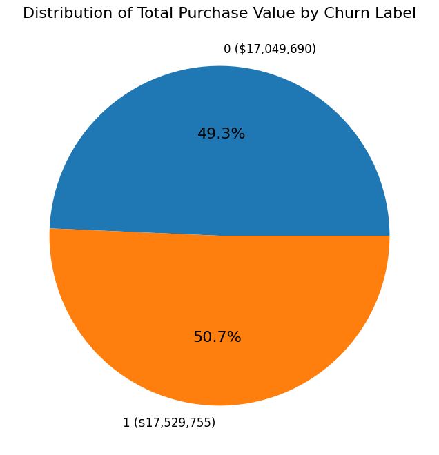
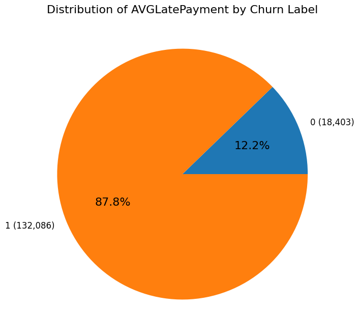
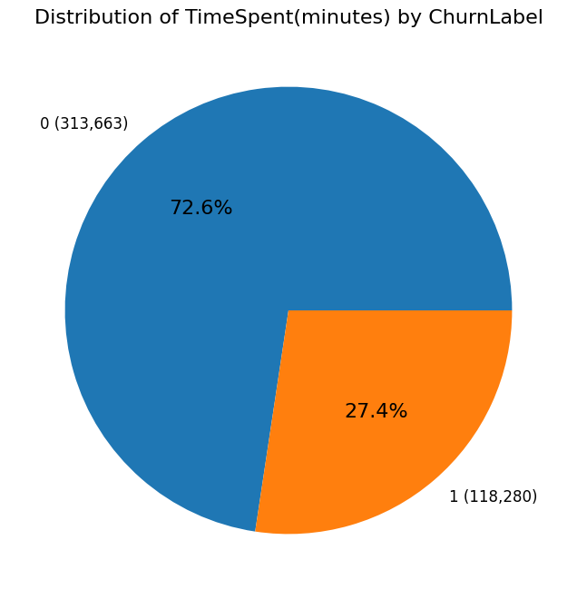
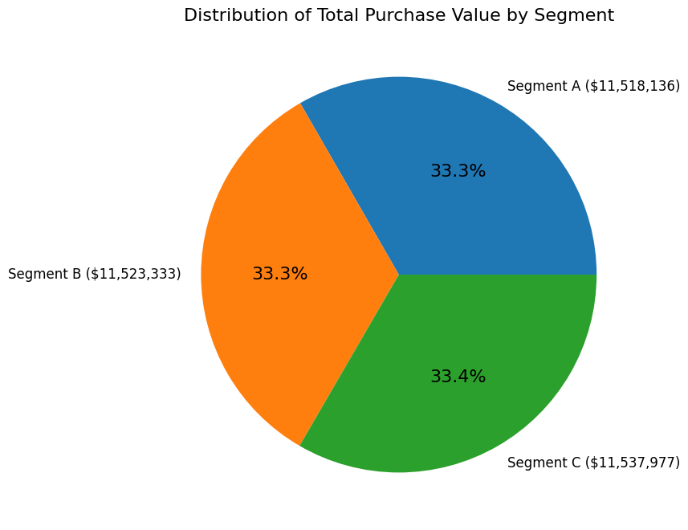

# Reder Telecom Customer Churn Prediction

## Business Context: Safeguarding Customer Retention

**Reder Telecom**, a telecommunications company, is struggling to retain its customers in an increasingly competitive market. This project develops a predictive machine learning model to identify customers at risk of churning, enabling proactive intervention strategies that can be applied in due time.

### Business Value & Advantages of Predicting Customer Churn

Predicting customer churn provides Reder Telecom with critical competitive advantages:

#### 1. **Revenue Protection & Income Safeguarding**
- **Retain current customers**: Retaining existing customers is significantly more cost-effective than acquiring new ones
- **Protect recurring revenue streams**: Early identification of at-risk customers helps prevent revenue loss
- **Reduce customer acquisition costs**: Focus resources on retention rather than expensive acquisition campaigns

#### 2. **Marketing Efficiency**
- **Targeted retention campaigns**: Direct marketing efforts toward high-risk customers identified by the model
- **Optimize marketing spend**: Allocate resources efficiently by prioritising intervention efforts where they matter most
- **Reduce wasted outreach**: Avoid unnecessary campaigns to satisfied customers who are not at risk

#### 3. **Improving Customer Satisfaction**
- **Proactive problem resolution**: Address customer issues before they escalate to churn
- **Enhanced customer experience**: Engage with at-risk customers to understand and resolve pain points
- **Build customer loyalty**: Demonstrate commitment to customer success through timely interventions

### Intervention Strategies Enabled by Predictions

The predictive model enables Reder Telecom to implement timely intervention strategies:

1. **Early Warning System**: Identify at-risk customers weeks in advance
2. **Personalized Retention Outreach**: Tailor communication based on churn risk factors
3. **Service Recovery Programs**: Address service quality issues before customers leave
4. **Incentive Optimization**: Offer targeted retention incentives to high-value at-risk customers

---

## Project Structure

```
reder-prediction/
├── README.md                           # Project documentation
├── DataCleaning/
│   ├── Dataset.xlsx                    # Original raw data (Purged for privacy)
│   ├── dataset-cleaning.ipynb          # Data cleaning notebook
│   ├── clean.py                        # Data cleaning functions
│   └── cleaned_dataset.csv             # Cleaned dataset output (Purged for privacy)
├── EDA/
│   ├── eda.ipynb                       # Exploratory data analysis
│   └── clean_train_data.csv            # Final prepared dataset for training (Purged for privacy)
├── model/
│   ├── model_2.ipynb                   # Model training & hyperparameter tuning
│   ├── model.pkl                       # Saved best model
│   └── schema.json                     # Model schema
├── app.py                              # Model deployment application
└── requirements.txt                    # Python dependencies
```

---

## Data Cleaning Process

### Overview
The data cleaning process transformed the raw customer dataset into a structured format suitable for machine learning. Key operations included data type conversion, feature engineering, encoding, and removal of irrelevant columns.

### Data Transformations & Encoded Columns

The following transformations were applied to prepare the data:

#### 1. **Date Feature Engineering**
The following date columns were converted to datetime format and extracted into year, month, and day components:
- `FirstInteractionDate` → `FirstInteractionDate_year`, `FirstInteractionDate_month`, `FirstInteractionDate_day`
- `LastInteractionDate` → `LastInteractionDate_year`, `LastInteractionDate_month`, `LastInteractionDate_day`
- `Timestamp` → `Timestamp_year`, `Timestamp_month`, `Timestamp_day`
- `Start_Date` → `Start_Date_year`, `Start_Date_month`, `Start_Date_day`
- `End_Date` → `End_Date_year`, `End_Date_month`, `End_Date_day`
- `most_recent_action_date` → `most_recent_action_date_year`, `most_recent_action_date_month`, `most_recent_action_date_day`

**Rationale**: Extracting temporal components enables the model to capture seasonal patterns and time-based trends in customer behavior.

#### 2. **Categorical Encoding**

**One-Hot Encoding** (Nominal Columns):
- `Gender` → `Gender_Female`, `Gender_Male`
- `TotalInteractionType` → `TotalInteractionType_Call`, `TotalInteractionType_Call|Chat`, `TotalInteractionType_Email`, etc.
- `Frequency` → `Frequency_Daily`, `Frequency_Weekly`, `Frequency_Monthly`, etc.

**Rationale**: One-hot encoding transforms nominal categorical variables into binary features that machine learning algorithms can process without imposing ordinal relationships.

**Label Encoding** (Ordinal Columns):
- `Segment` → Encoded as integers (e.g., Segment A = 0, Segment B = 1, Segment C = 2)
- `Plan` → Encoded as integers based on subscription tier

**Rationale**: Label encoding preserves the ordinal nature of these features while converting them to numeric format.

**Mean Encoding** (High Cardinality Columns):
- `Location` → Replaced with mean `TotalPurchaseValue` per location
- `ProductList` → Replaced with mean `TotalPurchaseValue` per product

**Rationale**: Mean encoding reduces dimensionality for high-cardinality categorical variables while preserving predictive signal based on purchase behavior.

#### 3. **Removed Columns**
The following personally identifiable information (PII) and irrelevant columns were dropped:
- `Name`, `Email`, `Phone`, `Address`, `Comment`

**Rationale**: These columns do not contribute to churn prediction and removing them protects customer privacy.

### Cleaning Steps Summary

1. **Convert data types**: Transform date columns to datetime format
2. **Feature engineering**: Extract temporal features from dates
3. **Drop irrelevant columns**: Remove PII and non-predictive fields
4. **Encode categorical variables**: Apply appropriate encoding based on variable type
5. **Save cleaned data**: Export to `cleaned_dataset.csv`

### Output
- **Clean dataset**: `DataCleaning/cleaned_dataset.csv`
- **Records**: ~100,000+ customer records
- **Features**: 38+ features after cleaning and encoding

---

## Exploratory Data Analysis (EDA)

The EDA phase revealed critical insights about customer behavior and churn patterns. Below are the most relevant visualizations and findings:

### Key Insights from Summary Statistics

#### 1. **Customer Age Distribution**
- **Mean age**: 43.93 years (median: 44)
- **Distribution**: Left-skewed, indicating most customers are middle-aged
- **Standard deviation**: 15.34 (relatively low variability)

#### 2. **Total Purchase Value**
- **Mean**: $2,770.12 (median: $2,701.16)
- **Distribution**: Right-skewed with potential outliers
- **Range**: $12.27 to $7,552.80
- **Insight**: Significant spending range suggests diverse customer segments, with opportunities to move low spenders to higher tiers

#### 3. **Average Late Payments**
- **Mean**: 12.05 days (median: 7.67)
- **Distribution**: Right-skewed
- **Key Finding**: **86.8% of late payments are from churned customers**, indicating strong correlation between payment behavior and churn

#### 4. **Customer Engagement Metrics**
- **Page Views**: Mean 50.63 (median: 51), relatively balanced distribution
- **Time Spent**: Mean 34.60 minutes (median: 26), right-skewed
- **Logins**: Mean 15.56 (median: 16)
- **Unexpected Finding**: Churned customers showed **higher time spent on website**, potentially indicating frustration or issue resolution attempts before leaving

### Most Relevant Visualizations

#### 1. **Customer Spending Distribution**

- **Key Insight**: Most customers spend between $0 and $4,000, with significant high-spenders above $5,000
- **Business Implication**: Opportunity for growth by implementing strategies to move low-to-mid spenders upward

#### 2. **Churn Distribution by Total Purchase Value**

- **Key Insight**: Identifies spending patterns that correlate with churn risk

#### 3. **Average Late Payments by Churn Label**

- **Key Insight**: **87.8% of late payments are concentrated among churned customers**
- **Business Implication**: Payment behavior is a strong predictor of churn

#### 4. **Time Spent Distribution by Churn Label**

- **Key Insight**: Churned customers spent less time on website
- **Business Implication**: Customer retention strategies need to be implemented to make customers to spend more time on the website.

#### 5. **Total Purchase Value by Segment**

- **Visualisation**: Pie chart showing purchase distribution across customer segments
- **Key Insight**: Purchase value is relatively balanced across segments (no dominant segment)

### Data Preparation for Model Training

After completing the exploratory analysis, the dataset was prepared for machine learning through the following steps:

1. **Encoding Categorical Variables**:
   - **One-Hot Encoding**: `Gender`, `TotalInteractionType`, `Frequency`
   - **Label Encoding**: `Segment`, `Plan`
   - **Mean Encoding**: `Location`, `ProductList`

2. **Feature Engineering**:
   - Extracted year, month, and day from all datetime columns
   - Removed original datetime columns after extraction

3. **Final Cleanup**:
   - Dropped `customer_segment` column (redundant feature)
   - Removed all remaining categorical object columns

4. **Train/Test Split Preparation**:
   - Final dataset saved as `clean_train_data.csv`
   - Ready for model training with all features converted to numeric format

---

## Model Training & Hyperparameter Tuning

All model development and evaluation was conducted in [`model_2.ipynb`](model/model_2.ipynb), which includes comprehensive model training, hyperparameter tuning, and evaluation using **Confusion Matrix**, **GridSearchCV**, and **RandomizedSearchCV**.

### Approach Overview

**Model**: Logistic Regression  
**Training/Test Split**: 70% training / 30% testing (random_state=42)  
**Target Variable**: `ChurnLabel` (binary classification)

### 1. Base Model Performance

A baseline Logistic Regression model was trained without hyperparameter tuning:

```python
model = LogisticRegression()
model.fit(X_train, y_train)
```

**Baseline Metrics**:
- Achieved initial accuracy as benchmark for comparison

### 2. Hyperparameter Tuning

The notebook implements **two comprehensive hyperparameter tuning approaches** to optimize model performance:

#### **GridSearchCV** (Exhaustive Search)

```python
from sklearn.model_selection import GridSearchCV

param_dist = {
    "penalty": ['l1', 'l2', 'elasticnet'],
    "solver": ['saga', 'sag', 'newton-cholesky'],
    "max_iter": [100, 200, 300]
}

model = LogisticRegression(random_state=42, n_jobs=1)
random_search = GridSearchCV(model, param_grid=param_dist, cv=4)
random_search.fit(X_train, y_train)
```

- **Cross-Validation**: 4-fold CV
- **Parameter Grid**: All combinations of penalty types, solvers, and iteration limits
- **Purpose**: Exhaustively search for optimal hyperparameter combination

#### **RandomizedSearchCV** (Efficient Sampling)

```python
from sklearn.model_selection import RandomizedSearchCV

param_dist = {
    "penalty": ['l1', 'l2', 'elasticnet'],
    "solver": ['saga', 'sag', 'newton-cholesky'],
    "max_iter": [100, 200, 300]
}

model = LogisticRegression(random_state=42, n_jobs=1)
random_search = RandomizedSearchCV(model, param_distributions=param_dist, cv=4, random_state=42)
random_search.fit(X_train, y_train)
```

- **Cross-Validation**: 4-fold CV  
- **Random Sampling**: Efficient exploration of hyperparameter space
- **Purpose**: Balance computational efficiency with comprehensive search

### 3. Model Evaluation

#### **Confusion Matrix Visualization**

The model's performance was evaluated using a confusion matrix heatmap:

```python
from sklearn.metrics import confusion_matrix
import seaborn as sns

cm = confusion_matrix(y_pred, y_test)
sns.heatmap(cm, cmap='Blues', annot=True, fmt='d')
plt.title('Confusion Matrix')
plt.ylabel('Actual')
plt.xlabel('Predicted')
plt.show()
```

**Purpose**: Visualise true positives, true negatives, false positives, and false negatives to assess classification performance

#### **Performance Metrics**

```python
from sklearn.metrics import accuracy_score, precision_score, recall_score

metrics = {
    "accuracy": accuracy_score(y_pred, y_test),
    "precision": precision_score(y_pred, y_test),
    "recall": recall_score(y_pred, y_test)
}
```

- **Accuracy**: Overall correctness of predictions
- **Precision**: Ability to correctly identify churned customers
- **Recall**: Ability to capture all actual churned customers

### 4. Final Model Selection

**Best Model**: The model from **GridSearchCV** was selected and saved as the final production model.

**Rationale**:
- GridSearchCV performed exhaustive search across all hyperparameter combinations
- Best parameters were identified through 4-fold cross-validation
- Model achieved optimal balance of accuracy, precision, and recall

**Model Artifact**:
- **Saved Model**: `model.pkl`
- **Schema**: `schema.json` (contains feature list for prediction input validation)

### Key Highlights

✅ **Confusion Matrix**: Provides detailed classification performance breakdown  
✅ **GridSearchCV**: Exhaustive hyperparameter optimization with 4-fold CV  
✅ **RandomizedSearchCV**: Efficient hyperparameter exploration for comparison  
✅ **Best Model**: Selected based on highest cross-validated accuracy and saved for deployment

---

## Model Deployment

The trained model is deployed using a Flask application ([`app.py`](app.py)) that provides a prediction endpoint for real-time churn prediction.

---

## Requirements

Install dependencies using:

```bash
pip install -r requirements.txt
```

**Key Dependencies**:
- `pandas`: Data manipulation and analysis
- `scikit-learn`: Machine learning algorithms and evaluation
- `matplotlib`, `seaborn`: Data visualization
- `fastapi`: Model deployment (if applicable)

---

## How to Run the Analysis

### 1. Data Cleaning
```bash
# Run the data cleaning notebook
jupyter notebook DataCleaning/dataset-cleaning.ipynb
```

Alternatively, use the Python script:
```python
from DataCleaning.clean import clean_data
import pandas as pd

df = pd.read_excel('DataCleaning/Dataset.xlsx')
cleaned_df = clean_data(df)
```

### 2. Exploratory Data Analysis
```bash
# Run the EDA notebook
jupyter notebook EDA/eda.ipynb
```

### 3. Model Training
```bash
# Run the model training notebook
jupyter notebook model/model_2.ipynb
```

### 4. Model Deployment
```bash
# Start the Flask application
python app.py
```

---

## Conclusion

This churn prediction model empowers **Reder Telecom** to take proactive measures in retaining customers, thereby:

- **Safeguarding income** by preventing revenue loss from churned customers
- **Improving marketing efficiency** through targeted retention campaigns
- **Enhancing customer satisfaction** by addressing issues before customers decide to leave

By leveraging machine learning to predict customer churn, Reder Telecom can shift from reactive customer service to proactive customer retention strategies, ultimately driving long-term business growth and customer loyalty.

---

## Future Improvements

- **Feature Engineering**: Incorporate additional behavioral features (e.g., support ticket frequency, network quality metrics)
- **Advanced Models**: Experiment with ensemble methods (Random Forest, XGBoost, Gradient Boosting)
- **Real-Time Monitoring**: Deploy model with automated retraining pipeline
- **A/B Testing**: Validate intervention strategies on identified at-risk customers

---

## Contact

For questions or collaboration opportunities, contact me:

1. [Hillary Mongare](mailto:hillarymongare70@gmail.com)
